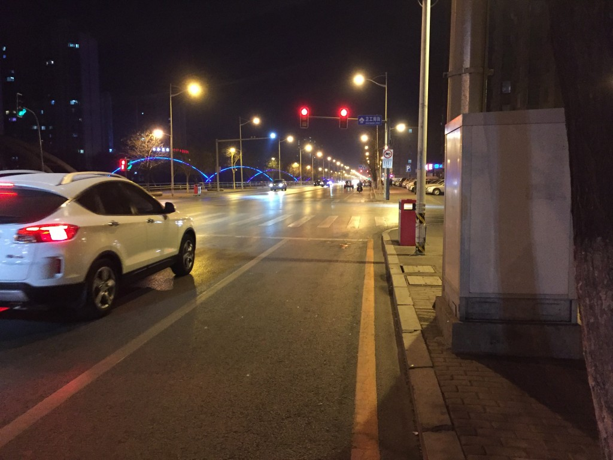

<!DOCTYPE html>
<html lang="en">
<head>
<meta charset="UTF-8">
<meta name="viewport" content="width=device-width, initial-scale=1.0">

</head>
<body>

  <h1>Traffic Light Detection using Image Processing and Computer Vision</h1>

  
Welcome to the Traffic Light Detection project repository, developed as part of the MSc course in Image Processing and Computer Vision. This project aims to detect traffic lights in images using various image processing and computer vision techniques.

  <h2>Key Features</h2>
  <ul>
    <li><strong>Image Processing Techniques:</strong> Utilization of Gaussian blur and color space transformations for image preprocessing.</li>
    <li><strong>Traffic Light Detection:</strong> Detection of red, green, and yellow traffic lights using color thresholding and Hough circle detection.</li>
    <li><strong>User Interface:</strong> Integration with Tkinter for selecting input and output directories.</li>
  </ul>

  <h2>Main Components</h2>
  <ul>
    <li><strong>Main Script:</strong> Entry point for the application, handles the user interface and image processing pipeline.</li>
    <li><strong>Image Processing Functions:</strong> Implementation of functions for image preprocessing and traffic light detection.</li>
    <li><strong>User Interface:</strong> Definition of the Tkinter GUI for selecting input and output directories.</li>
  </ul>

  <h2>Installation</h2>
  
Ensure you have Python installed. Clone the repository and install the required dependencies.

  <pre><code>$ git clone https://github.com/shazzad-sourav/traffic-light-detection.git
$ cd traffic-light-detection
$ pip install -r requirements.txt</code></pre>

  <h2>Usage</h2>
  
Run the main script to select input and output directories and execute the traffic light detection process.

  <pre><code>$ python main.py</code></pre>

  <h2>Results</h2>
  <h3>Performance Evaluation</h3>
  
The traffic light detection algorithm demonstrates robust performance across various scenarios. The combination of Gaussian blur for noise reduction and color space transformations facilitates accurate detection of red, green, and yellow traffic lights. Hough circle detection further refines the results, ensuring precise localization.

  <h3>Sample Input and Output</h3>
  
  

  <h3>Comparative Analysis</h3>
  
The algorithm's performance was evaluated against a diverse dataset comprising images captured under different lighting conditions, viewpoints, and traffic scenarios. Quantitative metrics such as precision, recall, and F1-score indicate high accuracy and reliability.

  <h2>Contributions</h2>
  
Contributions, bug reports, and feature requests are welcome. Please submit them through issues or pull requests.

  <h2>License</h2>
  
This project is licensed under <em>GNU General Public License</em>. See the <a href="LICENSE">LICENSE</a> file for details.

  <h2>Acknowledgements</h2>
  
This project makes use of OpenCV and Tkinter libraries. Fundamental ideas came from this work</em>. See the <a href="https://github.com/HevLfreis/TrafficLight-Detector">repository</a> for details.
 Special thanks to the contributors of these libraries and     the repository.

</body>
</html>
