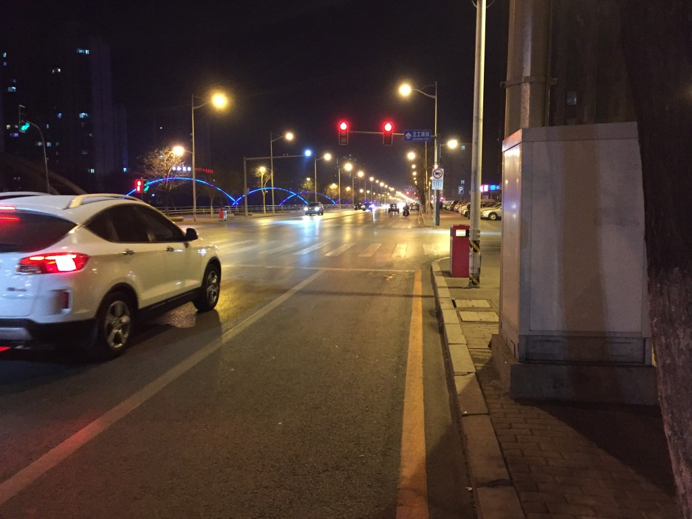

# Traffic Light Detection with Classical Computer Vision

Detects red, green, and yellow traffic lights in images using classical image processing (no deep learning). Built as a course project for an MSc course in Image Processing and Computer Vision.

| Input | Output |
|---|---|
|  |  |

## How it works

1. **Load and optionally blur:** each image is read with OpenCV. You can optionally apply a Gaussian blur (9x9 kernel, sigma 3), intended for very sharp images, by answering the dialog or passing `--blur`.
2. **HSV conversion:** the image is converted from BGR to HSV so color can be thresholded independently of brightness.
3. **Color masks:** red uses two hue ranges (0-10 and 160-180, saturation and value of at least 100) because red wraps around the hue axis. Green uses hue 40-90 (saturation and value of at least 50). Yellow uses hue 15-35 (saturation and value of at least 150).
4. **Circle detection:** Hough circle detection (radius up to 30 px) runs on each color mask separately.
5. **Filtering:** a candidate is kept only if it lies in the top 40% of the image, where traffic lights usually appear, and the mask is sufficiently filled in a small window around the circle center.
6. **Output:** accepted detections are circled and labeled RED, GREEN, or YELLOW, and the annotated image is saved to the output folder.

A whole folder of images is processed in one run, using either Tkinter folder dialogs or command-line arguments.

## Installation

```
git clone https://github.com/shazzad-sourav/TrafficLightDetectorConventional.git
cd TrafficLightDetectorConventional
pip install -r requirements.txt
```

Tkinter ships with Python. On some Linux systems you may need `sudo apt install python3-tk`.

## Usage

With folder dialogs:

```
python main.py
```

You will be asked for an input folder, an output folder, and whether to apply a Gaussian blur (asked once per run).

Without dialogs:

```
python main.py --input Input --output Output
python main.py --input Input --output Output --blur --no-display
```

In the preview windows, press any key for the next image, or `q` to stop previewing and finish processing silently.

You can also call the detector from your own code:

```python
import cv2
from main import detect

annotated, detections = detect(cv2.imread("Input/traffic_light_54.jpg"))
print(detections)  # [{'label': 'RED', 'x': 204, 'y': 270, 'radius': 7}, ...]
```

## Evaluation

**Test set:** 45 street-scene images (day and night, mixed sources). I labeled the 72 lit signal lamps (red, green, yellow) by hand. A detection is correct if its color matches an unmatched labeled lamp and its center is within max(20 px, 1.25 x its radius) of that lamp. 35 unclear lamps (pedestrian signals, tiny distant lamps, uncertain color) are marked "ambiguous" and left out of the main numbers. The images are not included in this repository because many carry stock-photo watermarks.

| | Precision | Recall | F1 |
|---|---|---|---|
| Overall | 0.70 | 0.76 | 0.73 |
| Day | 0.77 | 0.79 | 0.78 |
| Night | 0.60 | 0.72 | 0.66 |

| Color | Precision | Recall |
|---|---|---|
| Red | 0.72 | 0.70 |
| Green | 0.71 | 0.71 |
| Yellow | 0.65 | 0.94 |

Recall is 0.83 for circular lamps (53 of 64) and 0.25 for arrow lamps (2 of 8). Counting every ambiguous case against the detector gives precision 0.57 and recall 0.62; counting every ambiguous detection as correct gives 0.75 and 0.81. The Gaussian blur option lowered precision on this set (0.56), so it is off by default.

**Caveats:** a small test set, labeled by one person, so treat the numbers as indicative.

**Where it fails**

- Missed lamps (17): 6 arrow lamps (not circular), 6 small or weakly colored lamps, 4 red lamps washed out to white at night, and 1 rejected by the top-40% position rule.
- False detections (24): about 9 yellow glows from street lamps, trees, and walls; 4 neon or LED signs; 4 lit building windows; 1 car light; 1 speed-limit sign; 1 countdown display; 4 other.

Reproduce: `python evaluate_detector.py --images <folder> --gt ground_truth.csv --prefix input_` (you need your own copy of the test images; `ground_truth.csv` refers to that 45-image set, not to the `Input/` folder). Add `--blur` to score the blurred variant. The script writes per-detection results to `details.csv`. For the day/night split, add a `lighting` column (`day`/`night`) to the CSV or pass `--lighting <csv>`; otherwise images are classified automatically by mean brightness.

## Limitations

Classical methods depend on hand-tuned thresholds, so expect weaker results in these cases:

- Arrow lamps: the Hough step looks for circles, so arrows are mostly missed.
- Night scenes: street lamps, neon signs, and lit windows trigger false detections, and very bright red lamps wash out to white and fail the color mask.
- Lights in the lower 60% of the frame, which the position filter ignores.
- Fixed HSV thresholds and Hough parameters that were tuned by hand rather than learned.

A deep-learning detector would likely handle these better. This project is intended as a classical baseline.

## License

AGPL-3.0. See [LICENSE](LICENSE).

## Acknowledgements

The detection approach is based on [HevLfreis/TrafficLight-Detector](https://github.com/HevLfreis/TrafficLight-Detector). This version adds a Tkinter interface for batch processing and an optional Gaussian pre-filter. Built with OpenCV and Tkinter.
